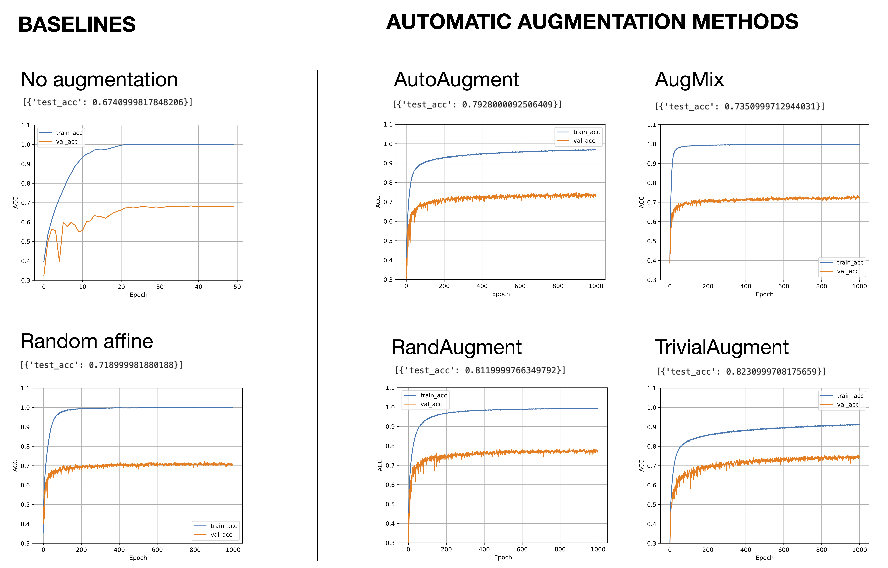

# Comparing Automatic Augmentation

A comparison of four automatic image augmentation techniques in PyTorch: AutoAugment, RandAugment, AugMix, and TrivialAugment.

The accompanying blog post can be found at: [https://sebastianraschka.com/blog/2023/data-augmentation-pytorch.html](https://sebastianraschka.com/blog/2023/data-augmentation-pytorch.html)

